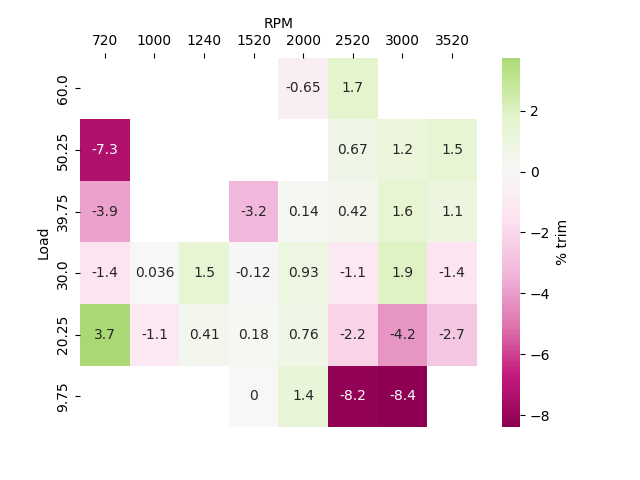
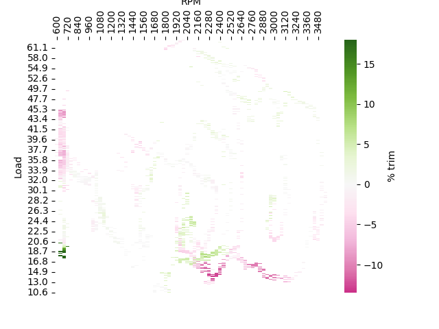

# Trim Heatmap

Graphs a heatmap of short term fuel trims (STFTs) from a ME7Logger log for use in tuning the ME7.1 `KFKHFM` MAF corrections map.

## How it works

Given a log with `nmot` `rl` and `fr/frm` data, it runs through each data point.

For every datapoint that is preceded by "similar" RPM/load samples (to throw out acceleration/deceleration points), sort it into a `KFKFHFM` cell.

For each cell that has enough samples, calculate the average and convert the lambda correction to a trim percentage.

Each of the above filters can be tuned individually - see [below](#adjusting-the-filters).

## Download

Check the [releases](https://github.com/nyetwurk/trim-heatmap/releases) section of this repo. Download the zip file for windows or one of the source archives for MacOS/Linux.

## Installation

Unzip the zip/tar file into an install directory.

### Linux/MacOS

`pip3 install argparse matplotlib numpy pandas seaborn`

See also [requirements.txt](./src/requirements.txt)

## Running

### Windows cmd.exe

`C:\PATH\TO\HEATMAP\INSTALL\DIR\heatmap.exe log.csv`

`heatmap.exe C:\PATH\TO_\SV\log.csv`

`C:\PATH\TO\HEATMAP\INSTALL\DIR\heatmap.exe log.csv log2.csv log3.csv`

### Linux/MacOS shell

`chmod +x /path/to/heatmap/dir/src/heatmap.py`

`/path/to/heatmap/dir/src/heatmap.py log.csv`

`./heatmap.py /path/to/csv/log.csv`

`/path/to/heatmap/dir/src/heatmap.py log.csv log2.csv log3.csv`

You can also use shell globbing to do this for you (not supported in windows yet):

`/path/to/heatmap_dir/src/heatmap.py *.csv`

As usual, you can always add `heatmap.py` or `heatmap.exe` to your `PATH`

### Headless

For pure text output, use `--csv` or `--text`

## Adjusting the filters

* Adjust the "previous samples" amount with the `-w WINDOW` option
* Adjust the "similar" load filter with the `-l LOAD_FILTER` option
* Adjust the "similar" RPM filter with the `-r RPM_FILTER` option
* Adjust the "minimum number of samples" filter with the `-s MIN_SAMPLES` option
* Disable the filter entirely with `-n`

## Adjusting the heatmap

* Show a continuous heatmap (instead of bucketed for KFKHFM) with `-c`

* Choose `frm` instead of `fr` with the `-fr` option
* Choose an unweighted mean using the `-u` option. The default is to weight the samples by their distance from the "center" of their cell (does not apply to `-c`)
